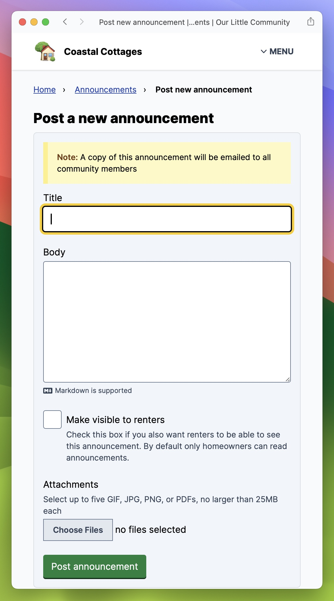

# Announcements

Announcements are a way for admins to share important information with the entire community. Announcements accomplish the same thing as sending a mass email — and everyone will get a copy of the announcement via email! — but they are less ephemeral because they'll continue to exist on the community website.

## Viewing announcements

All announcements are listed in chronological order, with the most recent announcement first.



<figure><figcaption>
A homeowner's view of all the announcements
</figcaption></figure>



<figure><figcaption>
An admin's view of all the announcements, including an indicator of which announcements are visible to renters
</figcaption></figure>




## Posting an announcement

Admins can post new announcements to the community. By default announcements are visible to all homeowners. But they can also be made available to renters. A copy of the announcement will be emailed to everyone in the community as well.

<figure><figcaption>
Creating a new announcement
</figcaption></figure>
