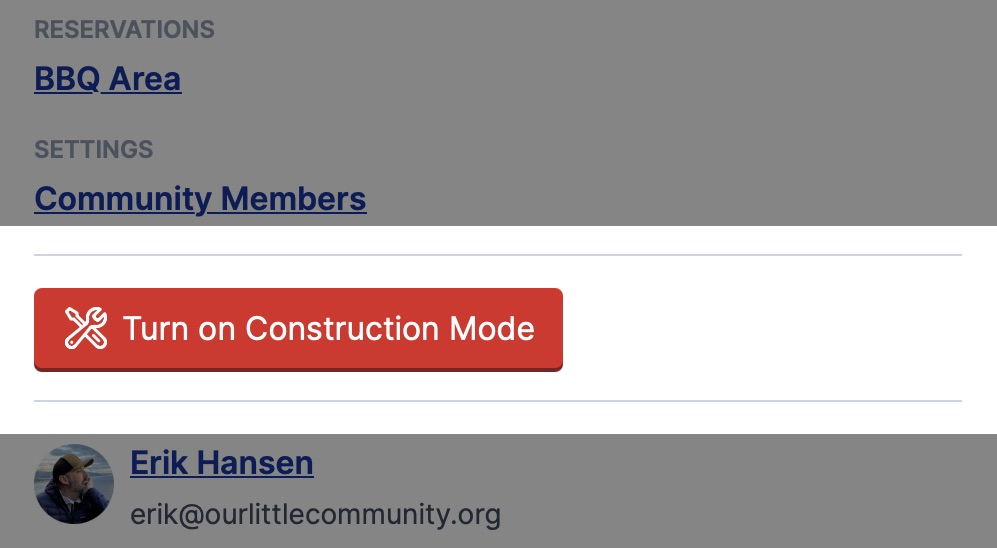

# Test Page


* [ ] Task list
* [ ] Item 2


***


```javascript
// Some code
```



<table data-view="cards"><thead><tr><th></th><th></th><th></th><th data-hidden data-card-cover data-type="files"></th><th data-hidden data-card-target data-type="content-ref"></th></tr></thead><tbody><tr><td>This is a card. Whatever that means</td><td></td><td></td><td></td><td></td></tr><tr><td>And another card with a "cover" image, whatever that is.</td><td></td><td></td><td><a href="../.gitbook/assets/olc-landing.jpeg">olc-landing.jpeg</a></td><td></td></tr><tr><td></td><td></td><td>And this card?</td><td></td><td><a href="https://app.gitbook.com/o/zVE4wfWnE0orO86YtQCP/s/DfcPuZhDcXQKbbjaMCa5/">another site?</a></td></tr></tbody></table>


<details>

<summary>Expandable thing</summary>

This is the content for the expandable thing.



I put an _image_ up there :point\_up:

</details>

<details>

<summary>A second expandable thing</summary>

Lorem ipsum mea singulis repudiare an, ad duo dolore voluptatum. Movet electram qualisque in quo, oporteat pertinax in his. Dicta vitae deseruisse id mel, mea idque nemore te. Sed utamur nusquam ea. Cu per mutat libris facilisi.

Ut vis zzril conceptam. Simul affert sapientem ius ex. Te usu dicunt docendi. Eam indoctum convenire cu.

Tale soleat facilis vel et, qui virtute dissentiunt no, causae eruditi sed ea. Qui posidonium liberavisse ut. Eu fugit aliquyam mandamus cum. Et legimus commune percipit sea, mea mucius graeco te, oratio delicata cum id. Ad has natum probo scribentur, ne nostrud aliquam urbanitas pro, id nonummy minimum qui. Nam malis choro partem ad.

Eos ex wisi electram aliquando, ullum populo no sea. Nisl argumentum conclusionemque mei eu, facilis deleniti ne mei, kasd verterem lobortis eos et. Eruditi veritus cum ad, et sale audiam gloriatur pro. Te duo habeo dissentiunt, ut sea vivendo mentitum periculis, an sit quodsi melius detracto. Putent dolores vim eu, nonumy omittantur vix no. Et facer voluptua consetetur eam, ex mea essent nonummy placerat. Sit platonem explicari conceptam ea.

</details>



### First step

Sign up. That should be easy I think

can I embed something like tabs in this step?

Or no? Just **text**?



### Another step

Lorem ipsum mea singulis repudiare an, ad duo dolore voluptatum. Movet electram qualisque in quo, oporteat pertinax in his. Dicta vitae deseruisse id mel, mea idque nemore te. Sed utamur nusquam ea. Cu per mutat libris facilisi.

Ut vis zzril conceptam. Simul affert sapientem ius ex. Te usu dicunt docendi. Eam indoctum convenire cu.

Eos ex wisi electram aliquando, ullum populo no sea. Nisl argumentum conclusionemque mei eu, facilis deleniti ne mei, kasd verterem lobortis eos et. Eruditi veritus cum ad, et sale audiam gloriatur pro. Te duo habeo dissentiunt, ut sea vivendo mentitum periculis, an sit quodsi melius detracto. Putent dolores vim eu, nonumy omittantur vix no. Et facer voluptua consetetur eam, ex mea essent nonummy placerat. Sit platonem explicari conceptam ea.



### Third _step_ with bold and _italics_

stuff and things and stuff




|   |   |   |
| - | - | - |
|   |   |   |
|   |   |   |
|   |   |   |
