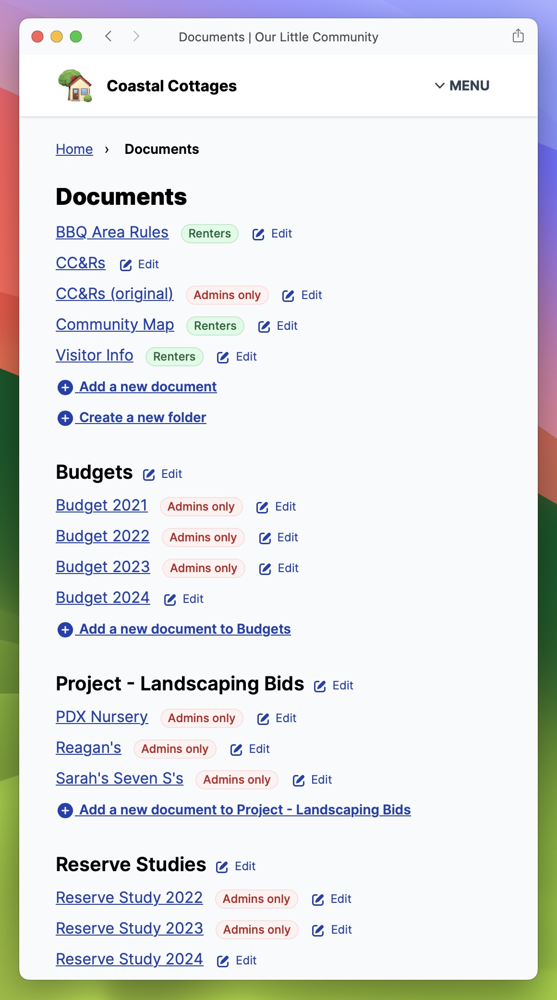
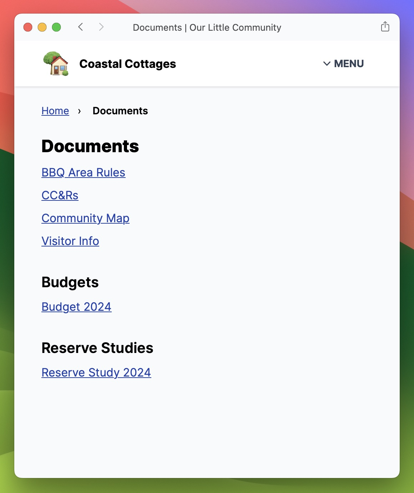
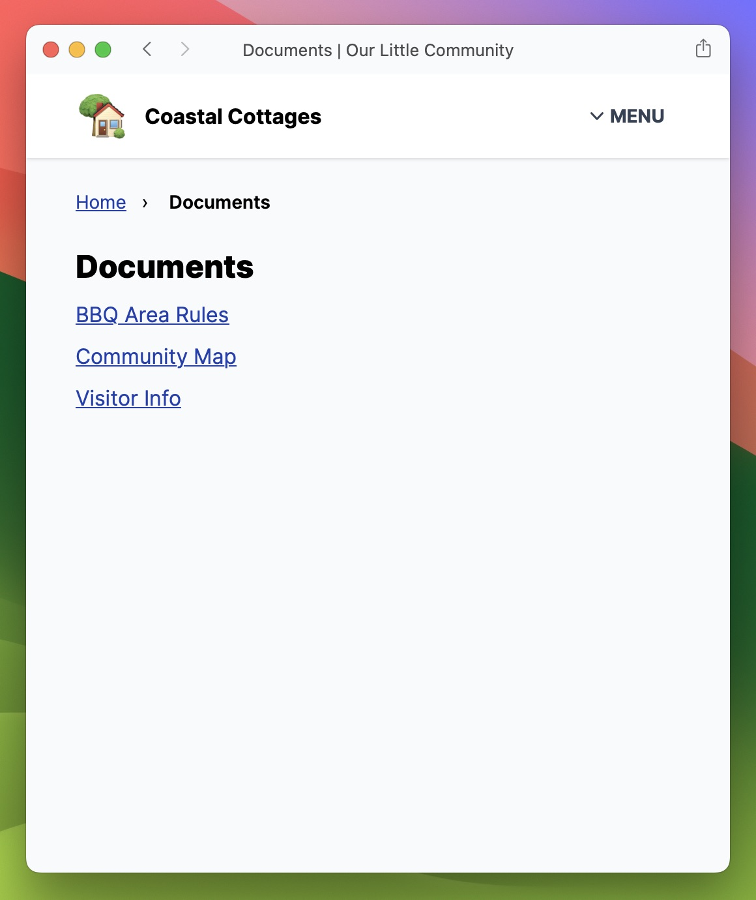

# Documents

The Documents section is the place for any documents that are important for your community: rules, budgets, bids, reserve studies, etc. Admins are able to add new documents and edit existing ones.



<figure><figcaption>
An admin's view of documents, including "edit" links and indicators of which documents are visible to renters and which are only visibly to admins. By default, documents are visible to homeowners and admins, but _not_ renters.
</figcaption></figure>



<figure><figcaption>
A homeowner's view of documents
</figcaption></figure>



<figure><figcaption>
A renter's view of documents
</figcaption></figure>




## Controlling access

You can control which types of community members can read each document. By default a new document will be available to homeowners. But documents can be made available to renters as well. Admins can always access every document.


Documents can only be added, edited, and removed by admins. Controlling access to a document only controls who can _read_ that document.


--show the permission choices--

## Document groups

Documents can be arranged in groups to keep things organized. You might want to have a group to hold all of your budgets, perhaps making only the most recent budget available to homeowners while making older budgets only available to admins.
